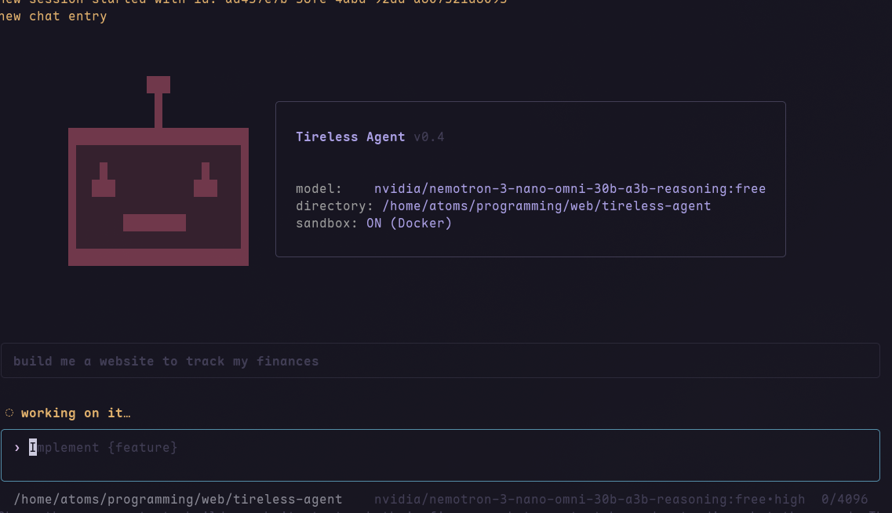

  

<h1 align="center">Tireless Agent</h1>

  <b>Tireless Agent</b> Tireless Agent is a dead simple Agentic Harness 

  
  
  
  

  <a href="#Installation">Installation</a> •
  <a href="#getting-started">Getting Started</a> •
  <a href="#Features">Features</a> • 
  <a href="#future-plans">Future Plans</a> •

# Tireless Agent CLI
tireless agent is a coding harness built with flexibility in mind 
its not a modular harness but its dead simple

it supports open router models and even gpt api key

more about it comming soon...
